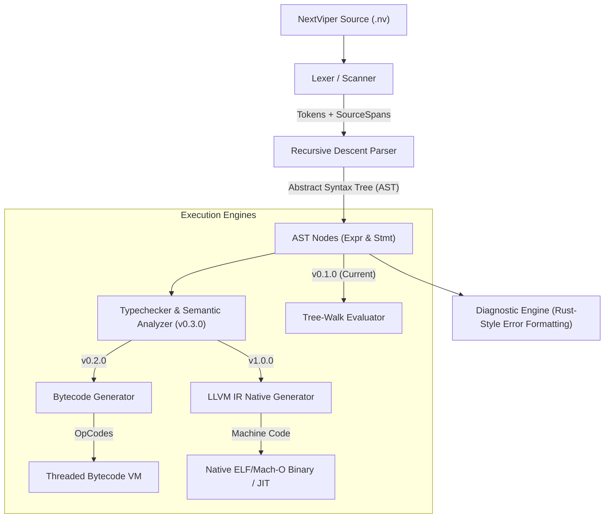

# NextViper Compiler & Runtime Architecture

This document provides a comprehensive technical overview of NextViper's architectural design, implementation language rationale, and the roadmap for its compilation pipeline.

---

## 1. Implementation Language Decision

For the core NextViper compiler frontend, intermediate representation (IR), interpreter, and runtime engine, **Modern C++ (C++20)** was chosen.

### 1.1 Comparative Evaluation

| Criterion | Modern C++20 (Chosen) | Rust | C11 | Go | Python |
|---|---|---|---|---|---|
| **Raw Execution Speed** | Maximum (Zero-cost abstractions) | Maximum | Maximum | Medium-High (GC pause) | Low (Interpreted) |
| **LLVM Ecosystem Integration** | Native 1:1 C++ API (Zero binding overhead) | Via `llvm-sys` / FFI | Via C API | Via CGo / Wrapper | Via ctypes / llvm-lite |
| **AI / GPU Engine Interoperability** | Direct C/C++ linking (libtorch, GGML, CUDA, TensorRT) | Requires unsafe FFI bindings | Direct | Complex through CGo | Wrapper overhead |
| **Zero External Toolchain Friction** | Compiles with standard GCC/Clang on any OS | Requires `rustup`/`cargo` | Requires standard toolchain | Requires Go runtime | Requires Python runtime |
| **Expressive Compiler Abstractions** | Smart pointers, `variant`, concepts, `string_view` | Enums with data, pattern matching | Manual struct unions | Interface types | Dynamic objects |
| **Deterministic Memory Management** | RAII + Custom Memory Arenas | Ownership / Borrow Checker | Manual `malloc`/`free` | Stop-the-world GC | Reference Counting + GIL |

### 1.2 Key Drivers for Modern C++20

1. **Direct LLVM Code Generator Integration**:
   LLVM is written in C++. Building the NextViper compiler in C++20 allows native, zero-friction instantiation of LLVM modules, builder contexts, optimization passes, and JIT execution engines (`llvm::orc::LLJIT`) without language binding impedance mismatches or outdated FFI wrappers.

2. **Native AI and High-Performance Compute Interoperability**:
   The AI and Machine Learning ecosystem (PyTorch / LibTorch, GGML, ONNX Runtime, CUDA, OpenBLAS, cuDNN) is fundamentally authored in C and C++. Implementing NextViper's runtime in C++ provides immediate, zero-copy interoperability with native tensor computations and GPU hardware accelerators.

3. **Portability and Dependency-Free Deployment**:
   Modern C++20 compiles into a single, compact, statically or dynamically linked native binary (`nextviper`) that runs on Linux (x86_64, aarch64), macOS (Apple Silicon, Intel), and Windows without requiring end-users to install heavy third-party runtimes.

4. **Modern Safety and Ergonomics**:
   C++20 eliminates legacy C++ pitfalls through concepts, `std::string_view`, `std::variant`, `std::unique_ptr`, `std::shared_ptr`, and strong type safety, achieving clean, maintainable, and high-performance compiler code.

---

## 2. Compilation & Execution Pipeline

---

## 3. Subsystem Breakdown

### 3.1 Lexer (`src/lexer.cpp`, `include/nextviper/lexer.hpp`)
- **Streaming Character Reader**: Reads source UTF-8 streams with single-character lookahead (`peek()`, `peek_next()`).
- **Precision Span Tracking**: Every token stores an exact `SourceSpan` (`start` location, `end` location, file path).
- **Literal Processing**: Scans integers (decimal, hex `0x`, binary `0b`), scientific floats, escaped strings, identifiers, and comments (`//` and `/* */`).

### 3.2 Parser (`src/parser.cpp`, `include/nextviper/parser.hpp`)
- **Recursive Descent Architecture**: Modular functions parsing statement hierarchies and expressions.
- **Precedence Climbing**: Implements proper mathematical binding order (Power -> Factor -> Term -> Comparison -> Equality -> Logical -> Pipeline -> Assignment).
- **Pipeline Transformation**: Directly transforms `x |> f(y)` into function application `f(x, y)` at parse/evaluation time.
- **Synchronization & Recovery**: On syntax errors, the parser skips malformed tokens to the next statement boundary (`let`, `fn`, `if`, `;`), reporting all syntax issues in a single pass.

### 3.3 Abstract Syntax Tree (`src/ast.cpp`, `include/nextviper/ast.hpp`)
- **Polymorphic Node Hierarchy**: Derived from base `ASTNode`, split into `Expr` and `Stmt`.
- **Visitor Pattern (`ASTVisitor`)**: Decouples AST node data structures from downstream compilers, evaluators, typecheckers, and printers.
- **AST Printer**: Generates human-readable indented tree structures for debugging and the `nextviper parse --ast` command.

### 3.4 Diagnostic Engine (`src/diagnostic.cpp`, `include/nextviper/diagnostic.hpp`)
- **Rust/Clang-Style Aesthetic Output**: Line numbers, gutters, source code previews, visual caret underlines (`^^^^`), and contextual suggestions.
- **SourceManager**: Efficiently caches file contents and computes line offsets on demand for line slicing.
- **ANSI Color Terminal Formatting**: Beautiful colored output in interactive terminals, with automatic fallback for non-TTY environments.

### 3.5 Runtime Environment & Value Model (`src/value.cpp`, `src/environment.cpp`)
- **Tagged `Value` Representation**: Compact value wrapper supporting dynamic primitive types (`Int`, `Float`, `Bool`, `String`, `Nil`) and reference-counted complex types (`Array`, `Object`, `Function`, `NativeFunction`).
- **Lexical Scope Chaining (`Environment`)**: Enclosing parent scopes with variable lookup and assignment.
- **Explicit Mutability Guard**: Attempting to rebind an immutable `let` variable triggers an immediate runtime error recommending `let mut`.

---

## 4. Extensibility Path for Bytecode VM and LLVM AOT

NextViper's modular architecture is designed to accommodate multiple backend execution targets:

1. **Bytecode VM Target (v0.2.0)**:
   A new `BytecodeCompiler` class implementing `ASTVisitor` will traverse the AST and emit a flat array of 32-bit bytecode instructions (OpCodes) executed by a register-based or stack-based Virtual Machine.

2. **LLVM Native Compiler Target (v1.0.0)**:
   An `LLVMCodegen` visitor will translate AST / NextViper IR directly into `llvm::Module`, `llvm::Function`, and `llvm::BasicBlock` instances, running LLVM optimization passes (`O2`, `O3`, `LTO`) and emitting native machine object code (`.o`, `.so`, standalone binaries).
