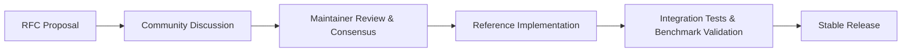

# NextViper Community Roadmap & Evolution

**Maintainer**: Nuratix LLC ([nuratix.com](https://nuratix.com))  
**Governance**: Open Source with Maintainer Review  
**Proposal Format**: NextViper RFCs (Request for Comments)

---

## 1. How Community Contributions Enter Future Releases

NextViper welcomes language enhancements and ecosystem expansions from community developers worldwide. To ensure backward compatibility, performance guarantees, and architectural coherence, all major features follow the **NextViper RFC Process**:

---

## 2. Roadmap Horizons

### Horizon 1: Ecosystem Maturity & Packaging (Current Focus)
- **Official POSIX Installer**: Automated script (`install.sh`) for macOS and Linux.
- **Error Documentation**: 100% real documentation routes for all diagnostic codes.
- **Language Server Protocol**: Enhanced autocomplete, go-to-definition, and hover hints.
- **Public Package Registry**: Web portal and CLI for publishing verified packages.

### Horizon 2: Native Optimizations & GPU Acceleration (Upcoming)
- **AOT Native Compiler**: Direct LLVM IR / native code emission via `nextviper build`.
- **Expanded Vulkan Compute**: Extended fused kernels for Transformer architectures and Convolutions.
- **WebAssembly (WASM) Target**: Compiling NextViper programs to WASM for client-side browser execution.

### Horizon 3: Multi-Language Interoperability
- **C-ABI Export**: Calling NextViper functions directly from C / C++ / Rust.
- **Python Bindings (`nextviper-py`)**: Zero-copy tensor exchange with NumPy and PyTorch.

---

## 3. Submitting an RFC

To propose a major change or addition to the language or standard library:
1. Open an issue on GitHub with the prefix `[RFC]: <Title>`.
2. Follow the template: Motivation, Detailed Design, Drawbacks, Alternatives, and Backward Compatibility.
3. Participate in the community review thread.
