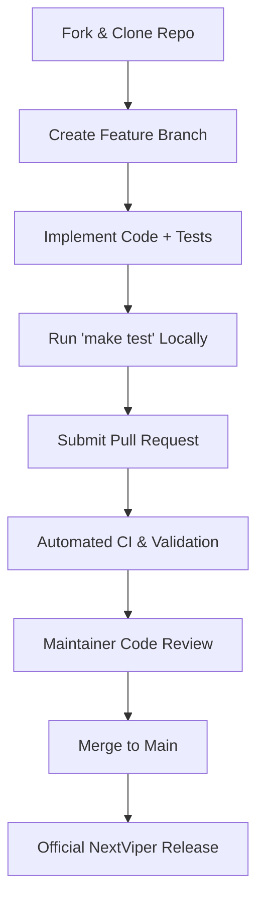

# Contributing to NextViper

Thank you for your interest in contributing to NextViper! As an open-source programming language maintained by **Nuratix LLC** ([nuratix.com](https://nuratix.com)), NextViper thrives on community participation, bug reports, performance enhancements, and standard library extensions.

---

## 1. Code of Conduct

All contributors and maintainers are expected to foster a respectful, collaborative, and inclusive environment. Technical criticism must always be constructive and focused on code, architecture, and performance.

---

## 2. Development Setup & Building

### 2.1 Prerequisites
- **Compiler**: GCC 11+ or Clang 13+ with full **C++20** support
- **Build System**: GNU Make (`make`) or CMake 3.20+
- **GPU Subsystem (Optional)**: Vulkan SDK headers and loader (`libvulkan-dev` or `vulkan-headers`)
- **Shell**: Bash / POSIX-compatible shell

### 2.2 Quick Start
```bash
# 1. Clone the repository
git clone https://github.com/nuratix/nextviper.git
cd nextviper

# 2. Build the toolchain (compiler + language server)
make -j$(nproc)

# 3. Run the full test suite
make test

# 4. Verify the CLI binary
./bin/nextviper --version
```

---

## 3. Contribution Workflow



1. **Fork the Repository**: Create your personal fork on GitHub.
2. **Create a Topic Branch**: Use descriptive branch names (e.g. `feat/stdlib-crypto`, `fix/lexer-unicode-escape`).
3. **Write Tests**: Every bug fix or new feature must be accompanied by automated unit tests in `tests/`.
4. **Adhere to Code Standards**:
   - Write clean, modern, idiomatic C++20.
   - Use `SourceSpan` and `DiagnosticEngine` for user-facing errors.
   - Do not leak raw pointers; prefer RAII and smart pointers (`std::shared_ptr`, `std::unique_ptr`).
5. **Submit a Pull Request**: Provide a detailed description of your changes, motivation, and test coverage.

---

## 4. Developer Certificate of Origin (DCO)

NextViper uses the Developer Certificate of Origin (DCO) to ensure open-source licensing integrity. By submitting a pull request, you certify that you have the right to submit the code under the project's **Apache License 2.0**.

To sign your commits:
```bash
git commit -s -m "feat(stdlib): add base64 encoder functions"
```

---

## 5. Areas for Community Contributions

- **Standard Library Modules**: Extending `std.math`, `std.collections`, `std.fs`, `std.json`, `std.crypto`.
- **GPU Kernel Optimizations**: Optimizing compute shaders and matrix multiplication in `src/gpu_kernels.cpp`.
- **Developer Tooling & LSP**: Enhancing Language Server features in `src/lsp.cpp` or the VS Code extension.
- **Documentation & Tutorials**: Improving examples, guides, and error code explanations.
- **Package Ecosystem**: Publishing reusable libraries on the NextViper Package Registry.

---

## 6. Security Vulnerabilities

Please **do not** open public GitHub issues for critical security vulnerabilities. Follow our responsible disclosure process outlined in [`SECURITY.md`](SECURITY.md) or email `security@nuratix.com`.
