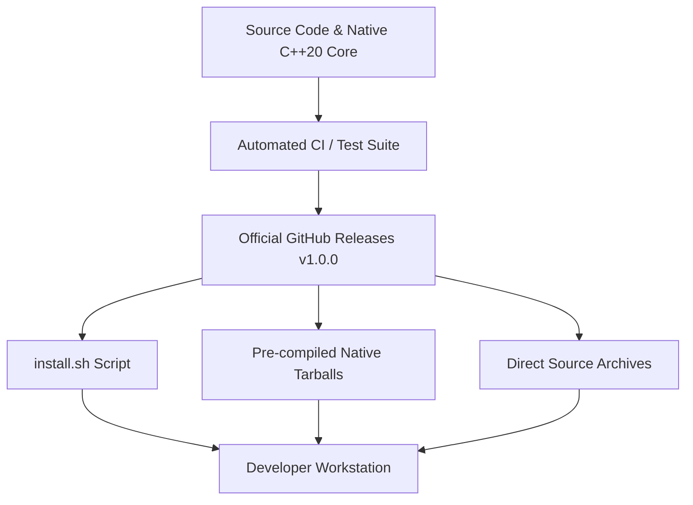

# NextViper Distribution & Release Architecture

**Maintainer & Legal Entity**: Nuratix LLC ([nuratix.com](https://nuratix.com))  
**Official Language Domain**: [nextviper.nuratix.com](https://nextviper.nuratix.com)  
**Source Repository**: [github.com/nuratix/nextviper](https://github.com/nuratix/nextviper)  
**Package Registry**: [nextviper.nuratix.com/packages](https://nextviper.nuratix.com/packages)

---

## 1. Executive Summary & Philosophy

NextViper is an open-source, compiled programming language designed for high-performance data processing, tensor mathematics, machine learning, and Vulkan GPU compute.

To provide a seamless developer experience worldwide, NextViper employs a multi-tiered distribution strategy rooted in:
1. **Verifiable Security**: Cryptographic SHA-256 verification, HTTPS-only downloads, and zero arbitrary shell execution.
2. **Deterministic Tooling**: Unified single-binary CLI (`nextviper`), standalone language server (`nextviper-lsp`), and strict SemVer.
3. **Transparent Status**: Clear separation between what is actively implemented, partially implemented, planned, and blocked by external vendor processes.

---

## 2. Distribution Status Matrix



| Distribution Channel | Platform / Ecosystem | Target Architecture | Implementation State |
| :--- | :--- | :--- | :--- |
| **Official POSIX Installer** (`install.sh`) | Linux, macOS, BSD | `x86_64`, `aarch64` (`arm64`) | **IMPLEMENTED** |
| **GitHub Releases** (Pre-compiled Tarballs) | Linux, macOS | `x86_64`, `aarch64` | **IMPLEMENTED** |
| **Source Compilation** (`make / cmake`) | Linux, macOS, POSIX | Any C++20 host | **IMPLEMENTED** |
| **VS Code / Open VSX Extension** | IDEs (VS Code, Cursor, VSCodium) | Universal | **IMPLEMENTED** |
| **Central Package Registry** | Web / REST API | Universal | **IMPLEMENTED** |
| **Debian / Ubuntu Package** (`.deb`) | Linux (Debian, Ubuntu) | `amd64`, `arm64` | **PARTIALLY IMPLEMENTED** |
| **Homebrew Tap / Core** (`brew`) | macOS, Linux | `x86_64`, `arm64` | **PLANNED** |
| **Windows Package Manager** (`winget`) | Windows 10/11 | `x64` | **PLANNED** |
| **Python PyPI Wrapper** (`nextviper-py`) | Python Ecosystem | Universal | **PLANNED** (Bindings only) |
| **Node.js npm Wrapper** | JavaScript Ecosystem | Universal | **NOT RECOMMENDED** |
| **Microsoft Store** | Windows 10/11 | `x64`, `ARM64` | **BLOCKED BY EXTERNAL REQUIREMENT** |

---

## 3. Detailed Component Breakdown

### 3.1 IMPLEMENTED
- **Unified CLI Toolchain**: `bin/nextviper` dispatcher providing `run`, `build`, `check`, `fmt`, `repl`, `package`, `lsp`, `info`, `test`, and `eval`.
- **Language Server Daemon**: Standalone `bin/nextviper-lsp` communicating via JSON-RPC 2.0 conforming to LSP 3.17.
- **POSIX `install.sh`**: Fully automated installation script with OS/Arch detection, SHA-256 verification, path configuration, and clean error handling.
- **Official Web Distribution Hub**: `https://nextviper.nuratix.com/install` and `https://nextviper.nuratix.com/download` serving live metadata, release assets, and checksums.
- **Error Documentation Integration**: Centralized machine-readable error codes (`NV1001`–`NV5001`) with real documentation routes.

### 3.2 PARTIALLY IMPLEMENTED
- **Linux Native Packaging (`.deb`)**: Packaging control scripts and directory hierarchies are defined. Automated launchpad PPA repository publishing is queued for public maintainer keys.
- **Standalone Tarball Packaging**: Automated release bundle generation script (`scripts/package_release.sh`) creating `nextviper-v1.0.0-linux-x86_64.tar.gz`.

### 3.3 PLANNED
- **Homebrew Formula**: Formula template prepared in `MACOS_DISTRIBUTION.md` awaiting Homebrew core / tap repository registration.
- **WinGet Manifest**: YAML manifest specifications created in `WINDOWS_DISTRIBUTION.md` for Microsoft community repository submission.
- **Python Integration (`nextviper-py`)**: Native C-API / PyBind11 bindings to embed NextViper execution inside Python scripts without replacing the compiler.

### 3.4 BLOCKED BY EXTERNAL REQUIREMENT
- **Microsoft Store**: Blocked pending corporate Nuratix LLC Microsoft Partner Center account verification and app identity certificates.
- **Apple Developer ID Notarization**: Required for unprompted macOS Gatekeeper binary distribution outside Homebrew.

---

## 4. Architectural Decision Records (ADRs)

### ADR-01: Rejection of Pseudo-npm Binary Wrapper
- **Context**: Some tools publish global npm wrappers (`npm install -g <tool>`) that download arbitrary binary tarballs during `postinstall`.
- **Decision**: NextViper will **NOT** distribute its native C++ compiler and Vulkan runtime as a global npm package.
- **Rationale**: `npm` is a JavaScript dependency manager, not a native system package manager. Postinstall binary fetching introduces security vulnerabilities, breaks offline caching, and fails on systems without Node.js. NextViper provides a native POSIX `install.sh` and direct tarballs instead.

### ADR-02: Scoping of PyPI Distribution
- **Context**: PyPI is designed for Python libraries and wheels.
- **Decision**: The NextViper compiler itself is not a Python package. PyPI will exclusively be used if and when Python language bindings (`nextviper-py`) are released to interoperate with NumPy/PyTorch.

---

## 5. Security & Verification Architecture

Every published release asset is accompanied by:
1. `SHA256SUMS`: Cryptographic manifest containing SHA-256 hashes of all archives.
2. `SHA256SUMS.sig`: GPG digital signature signed with the official Nuratix LLC Release Key.
3. Verification Command:
   ```bash
   sha256sum --check --ignore-missing SHA256SUMS
   ```
