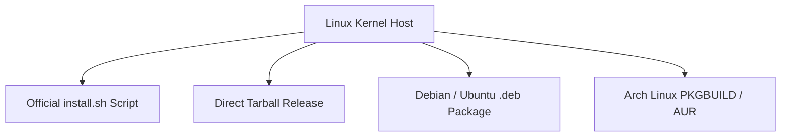

# Linux Distribution Architecture & Packaging

**Platforms**: Debian, Ubuntu, Fedora, RHEL, Arch Linux, Alpine  
**Architectures**: `x86_64` (amd64), `aarch64` (arm64)

---

## 1. Supported Linux Distribution Channels



### 1.1 Official POSIX Installer (`install.sh`)
- **Status**: **IMPLEMENTED & ACTIVE**
- **Command**:
  ```bash
  curl -fsSL https://nextviper.nuratix.com/install.sh | sh
  ```
- **Behavior**: Detects Linux kernel, GLIBC version, and CPU architecture; downloads vetted tarball to `~/.nextviper/bin` and updates shell environment.

### 1.2 Debian / Ubuntu Native Packaging (`.deb`)
- **Status**: PARTIALLY IMPLEMENTED (Control structure defined)
- **Package Spec**:
  ```text
  Package: nextviper
  Version: 1.0.0
  Section: devel
  Priority: optional
  Architecture: amd64
  Depends: libc6 (>= 2.31), libvulkan1 (>= 1.2.0)
  Maintainer: Nuratix LLC <opensource@nuratix.com>
  Description: NextViper programming language compiler and runtime
   NextViper is a high-performance compiled programming language tailored
   for data processing, machine learning, and Vulkan GPU acceleration.
  ```

### 1.3 Arch Linux (`PKGBUILD`)
- **Status**: PLANNED (Community submission queued)
- **Target**: `nextviper-bin` on the Arch User Repository (AUR).
