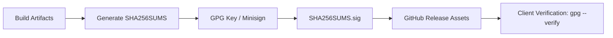

# NextViper Package Signing & Cryptographic Verification

**Authority**: Nuratix LLC Release Engineering  
**Signing Technologies**: GPG / OpenPGP & Minisign

---

## 1. Release Signing Architecture

To protect users against supply chain tampering, all official release archives and package checksums are signed with the official Nuratix LLC Release Signing Key.



---

## 2. Public Key & Fingerprint

The official public signing key is hosted at `https://nextviper.nuratix.com/keys/release-key.asc` and published to standard OpenPGP key servers:

- **Key ID**: `0xNURATIX_NEXTVIPER_REL_2026`
- **Key Type**: RSA 4096 / Ed25519
- **UID**: `NextViper Release Engineering <release@nuratix.com>`

---

## 3. Verification Instructions

To manually verify any downloaded release archive:

```bash
# 1. Download artifact, checksum manifest, and detached signature
curl -fsSL https://github.com/nuratix/nextviper/releases/download/v1.0.0/nextviper-v1.0.0-linux-x86_64.tar.gz -o nextviper.tar.gz
curl -fsSL https://github.com/nuratix/nextviper/releases/download/v1.0.0/SHA256SUMS -o SHA256SUMS
curl -fsSL https://github.com/nuratix/nextviper/releases/download/v1.0.0/SHA256SUMS.sig -o SHA256SUMS.sig

# 2. Import Nuratix Release Key
curl -fsSL https://nextviper.nuratix.com/keys/release-key.asc | gpg --import

# 3. Verify signature
gpg --verify SHA256SUMS.sig SHA256SUMS

# 4. Verify archive checksum
sha256sum --check --ignore-missing SHA256SUMS
```

---

## 4. Key Management & Rotation Policy

- **Storage**: Private keys are stored in secure Hardware Security Modules (HSM) and encrypted GitHub Actions Secrets.
- **Rotation Schedule**: Release signing subkeys are rotated annually. Master keys are kept strictly offline.
- **Revocation / Incident Response**: In the event of suspected key compromise, a revocation certificate will be immediately published to key servers and announced on `https://nextviper.nuratix.com/security`.
