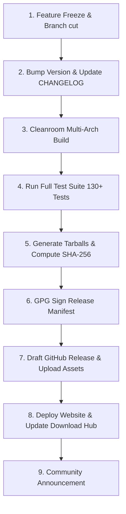

# NextViper Official Release Process & Checklist

This document outlines the step-by-step procedure followed by Nuratix LLC maintainers to build, test, sign, and publish an official NextViper release.

---

## 1. Step-by-Step Release Pipeline



---

## 2. Release Checklist

### Step 1: Pre-Release Validation
- [ ] Ensure all pull requests for the milestone are merged into `main`.
- [ ] Run full test runner locally: `make test`.
- [ ] Run fuzz testing suite: `./bin/test_runner` (Fuzz suite).
- [ ] Run automated link audit across documentation and website: `npx tsx scripts/check-links.ts`.

### Step 2: Version Bumping
- [ ] Update version in `include/nextviper/common.hpp` / `CMakeLists.txt` / `nextviper.toml`.
- [ ] Update `RELEASES.md` with release notes and breaking changes.
- [ ] Commit version bump: `git commit -m "chore(release): bump version to v1.0.0"`.
- [ ] Create signed Git tag: `git tag -s v1.0.0 -m "NextViper v1.0.0 Release"`.

### Step 3: Build & Package Artifacts
- [ ] Execute release packaging script:
  ```bash
  bash scripts/package_release.sh v1.0.0
  ```
- [ ] Verify generated archive contents:
  ```
  nextviper-v1.0.0-linux-x86_64.tar.gz
  nextviper-v1.0.0-linux-arm64.tar.gz
  nextviper-v1.0.0-darwin-arm64.tar.gz
  nextviper-v1.0.0-darwin-x86_64.tar.gz
  nextviper-v1.0.0-src.tar.gz
  ```
- [ ] Generate cryptographic checksums:
  ```bash
  sha256sum *.tar.gz > SHA256SUMS
  ```

### Step 4: GitHub Release & Publication
- [ ] Push git tag to GitHub: `git push origin v1.0.0`.
- [ ] Upload archives, `SHA256SUMS`, and `SHA256SUMS.sig` to GitHub Releases.
- [ ] Publish GitHub Release.

### Step 5: Web Portal Synchronization
- [ ] Update download metadata in `NextViperweb` repository.
- [ ] Verify `https://nextviper.nuratix.com/install.sh` downloads the new stable release.
- [ ] Validate `/download` and `/releases` routes.
